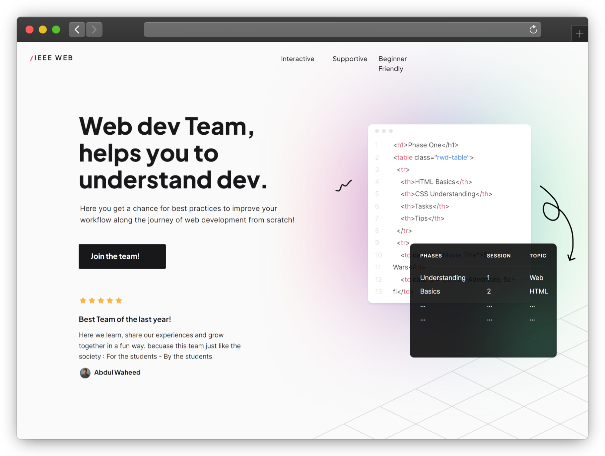

# Landing Page for Web Development team | IEEE CUI

Figma to React using Locofy - Get pixel perfect, high-quality code
Generate responsive, component-based React code and a live responsive prototype for your web design.

## Screenshot

- Here the link of live Demo:

   

## Built with

- 
- 
- 
- 

## Feedback

If you have any feedback, please reach out to us at abdulwaheed@ieee.org

## 🔗 Links

